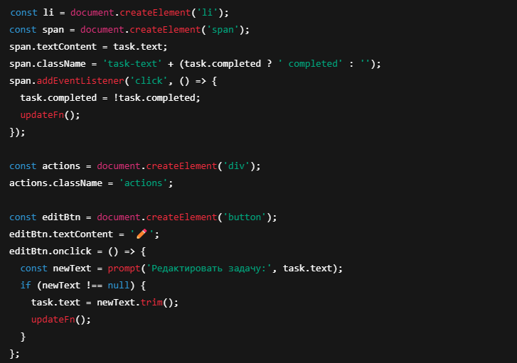
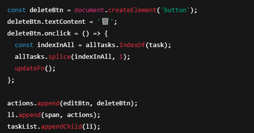
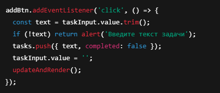
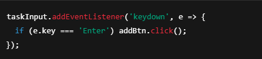
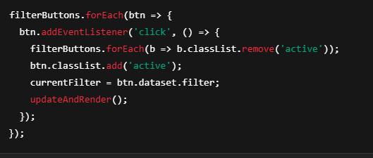
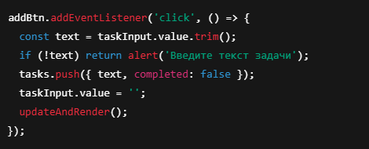
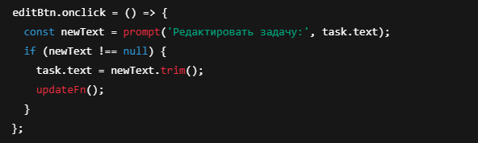
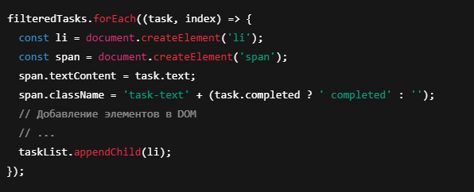
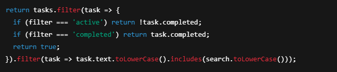
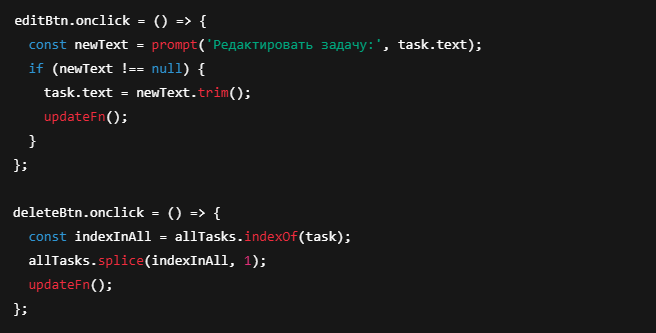

# Индивидуальный Проект

по дисциплине «JavaScript»
Выполнил: Чадаврь Олег 
Группа IA2403

## Цель проекта

Цель проекта — развить и подтвердить практические навыки программирования на JavaScript, включая работу с DOM, событиями, обработкой данных, пользовательским вводом и организацией кода в модульной структуре. Проект должен показать умение создавать интерактивные, понятные и поддерживаемые интерфейсы без использования сторонних фреймворков.

## Основное требование

Разработка веб-приложения или функционального модуля с использованием чистого JavaScript (Vanilla JS).

### Функциональные требования

1. Реализовать работу с DOM: динамическое создание, изменение и удаление HTML-элементов.

2. Использовать обработчики событий (_например_, клики, ввод текста, отправка формы и т.д.).
Отработчик клика по кнопке 'Добавить'

Отработчик по Enter

Ввод текста в поисковую строку

Клик по иконкам фильтра

3. Реализовать валидацию пользовательского ввода и вывод понятных сообщений об ошибках.
Валидация при добавлнии задачи

Валидация при редактировании задачи

4. Выполнить работу с массивами объектов:
   1. отобразить список элементов (например, товаров, пользователей, книг и т.п.),
   
   2. реализовать фильтрацию, сортировку или поиск по этим данным.
   
5. Обеспечить удобный и адаптивный интерфейс, ориентированный на пользователя.
6. _(Опционально)_ Включить взаимодействие с внешним API для загрузки или отправки данных.
7. Добавить интерактивные элементы (_например_, вкладки, модальные окна, анимации, dragNdrop), улучшающие пользовательский опыт.

### Нефункциональные требования

1. Использование ES6+ синтаксиса и возможностей JavaScript.
2. Структурирование кода с использованием модульного подхода.
3. Код должен быть оформлен с соблюдением принципов читаемости: осмысленные названия переменных и функций, комментарии при необходимости.
4. Страница должна быть стилизована с использованием CSS, обеспечивая приятный и современный внешний вид.
5. Подготовить краткую документацию (`README.md`) с инструкцией по запуску и кратким описанием проекта.

_Максимальное количество участников в одном проекте — 2 человека. Возможность работы в паре согласуется с преподавателем и зависит от объёма и сложности выбранной темы._

## Примеры возможных тем

- _To-Do List_: создание списка задач с возможностью добавления, удаления, редактирования, поиска и фильтрации по статусу.
- _Планировщик расписания_: отображение событий, редактирование и фильтрация по дате/категории.
- _Калькулятор_: создание простого калькулятора с возможностью выполнения базовых арифметических операций.
- _Галерея изображений_: отображение изображений с возможностью фильтрации, сортировки и просмотра в полноэкранном режиме.
- и другие.

## Отчет

Представьте отчет о выполненной индивидуальной работе в виде файла readme.md и отправьте ссылку на проект GitHub на платформу Moodle.

Проект должен быть размещен в репозитории Git (при желании вы можете использовать [gitlab.usm.md](gitlab.usm.md)).

Файл `readme.md` должен содержать следующую информацию:

1. Инструкции по установке и запуску проекта
Необходимые зависимости
Современный браузер (Chrome, Firefox, Edge и т.д.)

Node.js и сервер не требуются — проект работает полностью на клиенте.

Запуск проекта
Склонируйте репозиторий или скачайте файлы проекта.

Откройте файл index.html в браузере двойным кликом или через контекстное меню.

Готово! Можно использовать приложение.
2. Авторов проекта. Ceavdari Oleg IA2403
3. Описание вашего проекта, включая цель и основные функции.
 Описание проекта
To-Do List — это простое веб-приложение для управления списком задач.

Цель проекта
Развить навыки работы с чистым JavaScript (Vanilla JS).

Освоить динамическую работу с DOM, событиями, валидацией ввода и локальным хранением данных.

Создать удобный и интуитивно понятный интерфейс без использования фреймворков.

Основные функции
Добавление новых задач.

Редактирование и удаление существующих задач.

Отметка задач как выполненных кликом.

Фильтрация задач по статусу: все, активные, выполненные.

Поиск задач по тексту.

Сохранение данных в localStorage для сохранения между сессиями.
4. Примеры использования проекта, включая скриншоты или фрагменты кода, если это уместно.
5. Список использованных источников.
Использованные источники
MDN Web Docs — https://developer.mozilla.org/

JavaScript.info — https://javascript.info/

Stack Overflow — https://stackoverflow.com/
6. Любые другие значимые аспекты, которые вы считаете необходимыми.

